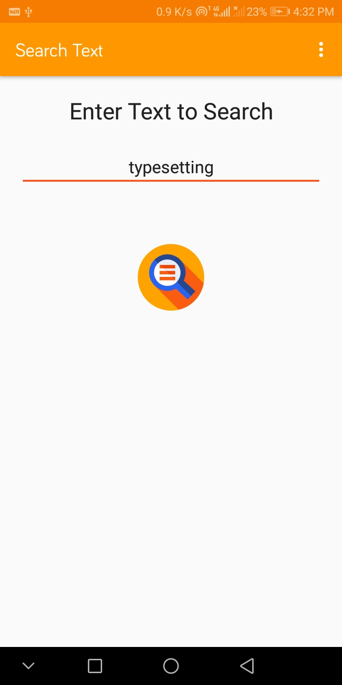
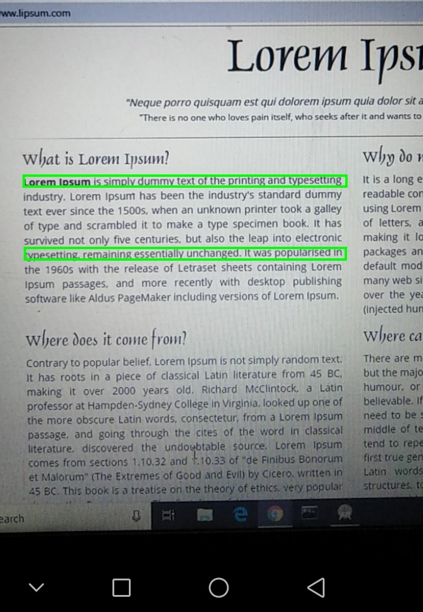
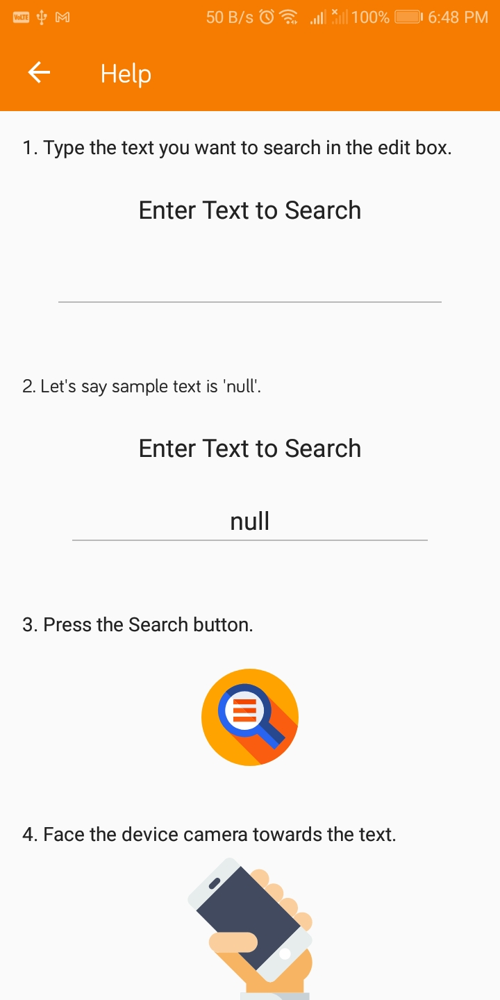

# SearchText
Android Application to search text on a page or screen using Google Mobile Vision API.

### Wanna try ? [Get apk](https://drive.google.com/file/d/1toy9856Kcv_EUr5G3ydSMvAS8qaPqGPD/view?usp=sharing)

## Working
1. Enter text in the text field.
2. Face the camera in front of page or screen.
3. Get the green rectangular shape around the location of text on the screen.

# Screenshots
| Edit Text       | Selection View  | Help    |
|-----------------|-----------------|---------|
||||

